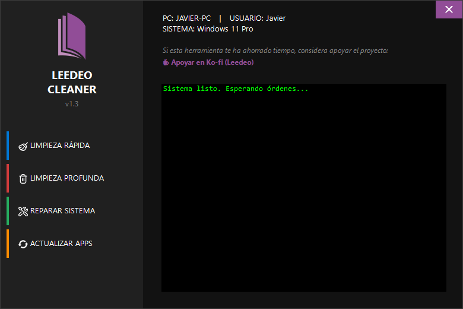

# 🧹 Leedeo Cleaner

  

**Leedeo Cleaner** es una herramienta de mantenimiento y reparación para Windows diseñada para ser **rápida, ligera y 100% portable**. Sin instalaciones, sin publicidad y de código abierto.

Elimina archivos basura, optimiza el sistema y ejecuta comandos de reparación nativos de Microsoft (SFC/DISM) con una interfaz moderna y amigable.

---

## 🚀 Características Principales

*   **⚡ Limpieza Rápida:** Borra archivos temporales (`%TEMP%`), vacía la caché de DNS y reinicia el explorador de archivos para solucionar errores visuales. Ideal para el uso diario.
*   **🗑️ Limpieza Profunda:** Elimina logs antiguos de Windows, caché de actualizaciones (Windows Update), historial de Defender y Prefetch. Recupera espacio en disco.
*   **🛡️ Reparación de Sistema:** Automatiza la ejecución de los comandos `SFC /SCANNOW` y `DISM` (RestoreHealth/ComponentCleanup) para arreglar archivos corruptos del sistema operativo.
*   **💾 100% Portable:** Un solo archivo `.exe`. Llévalo en tu USB.
*   **🔍 Transparente:** Código abierto bajo licencia MIT. Nada oculto.

---

## 📥 Descarga e Instalación

Puedes descargar la última versión compilada desde la sección de **Releases**:

👉 **[Descargar Leedeo Cleaner](https://github.com/Leedeo/Leedeo-Cleaner/releases/latest)**

> **⚠️ Nota sobre Windows Defender / SmartScreen:**
> Al ser una aplicación nueva y creada por un desarrollador independiente (no firmada digitalmente), es posible que Windows muestre una advertencia azul diciendo "Windows protegió su PC".
>
> Esto es normal en software open-source nuevo. Para usarla, simplemente haz clic en **"Más información"** y luego en **"Ejecutar de todas formas"**.

---

## 🛠️ Cómo compilarlo tú mismo (Opcional)

Si prefieres compilar el código fuente por tu cuenta para máxima seguridad:

1.  Descarga este repositorio (botón `Code` > `Download ZIP`).
2.  Asegúrate de tener los archivos `logo.png`, `icono.ico` y los botones PNG en la misma carpeta.
3.  Ejecuta el archivo **`Compilar.bat`**.
4.  El script utilizará el compilador nativo de .NET Framework de tu Windows para generar `LeedeoCleaner.exe`.

---

## ⚠️ Responsabilidad (Disclaimer)

Este software se proporciona "tal cual", sin garantía de ningún tipo.
Aunque **Leedeo Cleaner** utiliza comandos estándar y seguros de Windows, el uso de herramientas de limpieza y reparación conlleva riesgos inherentes. **Leedeo Studio no se hace responsable** de posibles pérdidas de datos o daños en el sistema derivados del uso de esta herramienta. Se recomienda usar la opción "Reparar Sistema" solo si tienes conocimientos básicos o si tu PC presenta fallos.

---

## ☕ Apoya el proyecto

Si esta herramienta te ha sido útil y quieres apoyar el desarrollo de más software gratuito:

---

**Creado con ❤️ por Leedeo Studio.**
