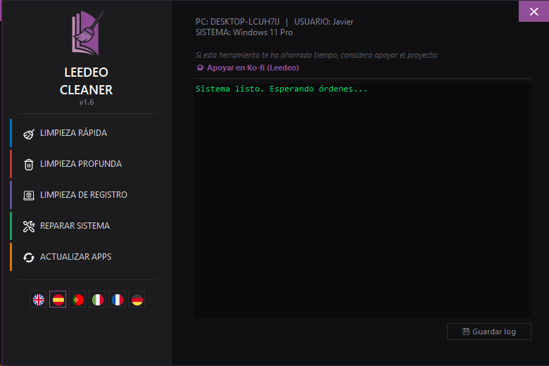

# 🧹 Leedeo Cleaner

  

**Leedeo Cleaner** is a maintenance and repair tool for Windows designed to be **fast, lightweight and 100% portable**. No installation, no ads, open source.

It removes junk files, optimizes the system, cleans the registry and runs Microsoft's native repair commands (SFC/DISM) through a clean, modern interface. The language is automatically detected from your OS — English, Spanish, Portuguese, Italian, French and German are supported.

---

## 🚀 Features

- **⚡ Quick Clean** — Deletes temp files (`%TEMP%`), flushes the DNS cache and restarts Explorer to fix visual glitches. Good for daily use.
- **🗑️ Deep Clean** — Removes old Windows logs, Windows Update cache, Defender history and Prefetch. Recovers disk space.
- **🗂️ Registry Cleaner** — Scans for orphaned uninstall entries, broken autostart entries and stale file references. Shows you exactly what it found before deleting anything.
- **🛡️ System Repair** — Runs `CHKDSK`, `SFC /SCANNOW` and `DISM` (ScanHealth / CheckHealth / RestoreHealth / ComponentCleanup) in the correct order, with smart result detection at each step.
- **📦 Update Apps** — Uses Winget to list available updates and lets you review before installing anything.
- **💾 Export log** — Save the full output of any operation as a `.txt` file.
- **🌍 6 languages** — Switch between EN, ES, PT, IT, FR and DE at any time using the flag buttons in the sidebar.
- **🔍 Portable & transparent** — Single `.exe` file. No installer, no telemetry. MIT licensed.

---

## 📥 Download

The latest compiled release is always available here:

👉 **[Download Leedeo Cleaner](https://github.com/Leedeo/Leedeo-Cleaner/releases/latest)**

More information at **[leedeo.github.io](https://leedeo.github.io/projects/leedeo-cleaner/)**.

> **⚠️ Windows Defender / SmartScreen notice**
>
> Because this is an independently developed app without a digital signature, Windows may show a blue warning screen saying "Windows protected your PC". This is a false positive caused by the file not yet having enough reputation with Microsoft's systems — it is not a virus.
>
> To run it: click **"More info"** → **"Run anyway"**.

---

## 🛠️ Build it yourself

If you prefer to compile from source for maximum peace of mind:

1. Download this repository (`Code` → `Download ZIP`).
2. Make sure all assets are in the same folder: `logo.png`, `icon.ico`, `btn_quick.png`, `btn_deep.png`, `btn_repair.png`, `btn_update.png`, `btn_registry.png` and the six flag PNGs (`flag_en.png` … `flag_de.png`).
3. Run **`build.bat`**.
4. The script will use the .NET Framework compiler already present on your Windows installation to produce `LeedeoCleaner.exe`.

> Requires .NET Framework 4.x (included in Windows 10 and 11 by default).

---

## ⚠️ Disclaimer

This software is provided as-is, without warranty of any kind. Leedeo Cleaner uses standard Windows commands, but cleaning and repair operations carry inherent risks. **Leedeo Studio is not responsible** for any data loss or system damage resulting from the use of this tool. It is recommended to use the System Repair option only if your PC is showing actual issues.

---

## ☕ Support the project

If this tool saved you time, consider buying me a coffee:

---

**Made with ❤️ by [Leedeo Studio](https://www.youtube.com/@Leedeo).**
